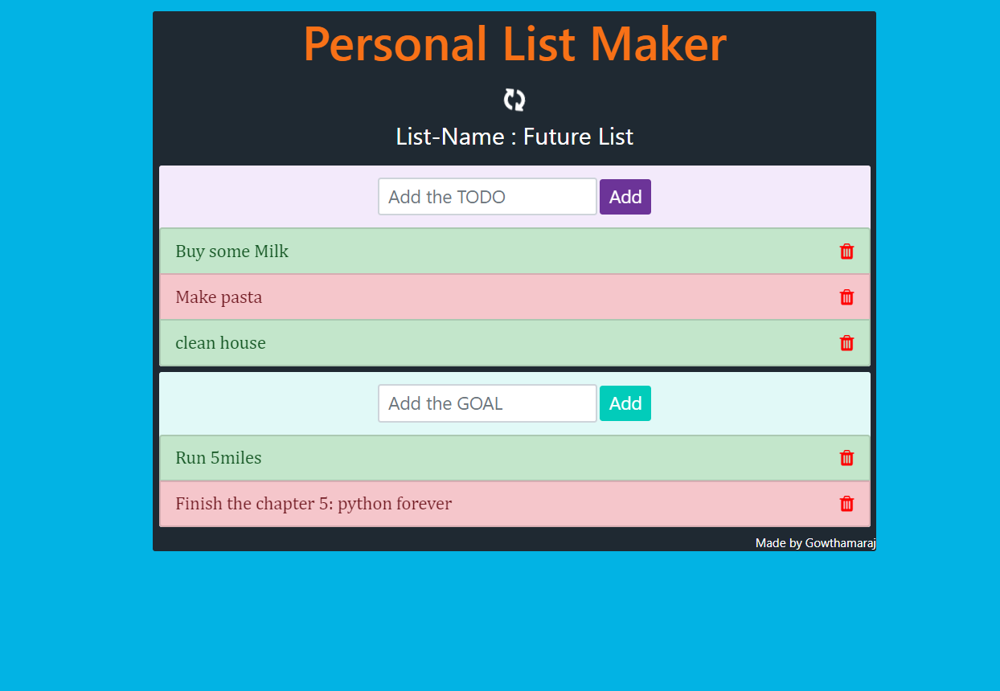

# TODO App With own-Redux-mini
This app is created with bootstrap and vanilla JS. The application has the following function on it.
1) Add to the list.
2) delete from the list.
3) Mark as completed.
4) Add name to the List. 

live on:[https://gowthamaraj-react-todo.netlify.app/](https://gowthamaraj-react-todo.netlify.app/)

## Screenshot
